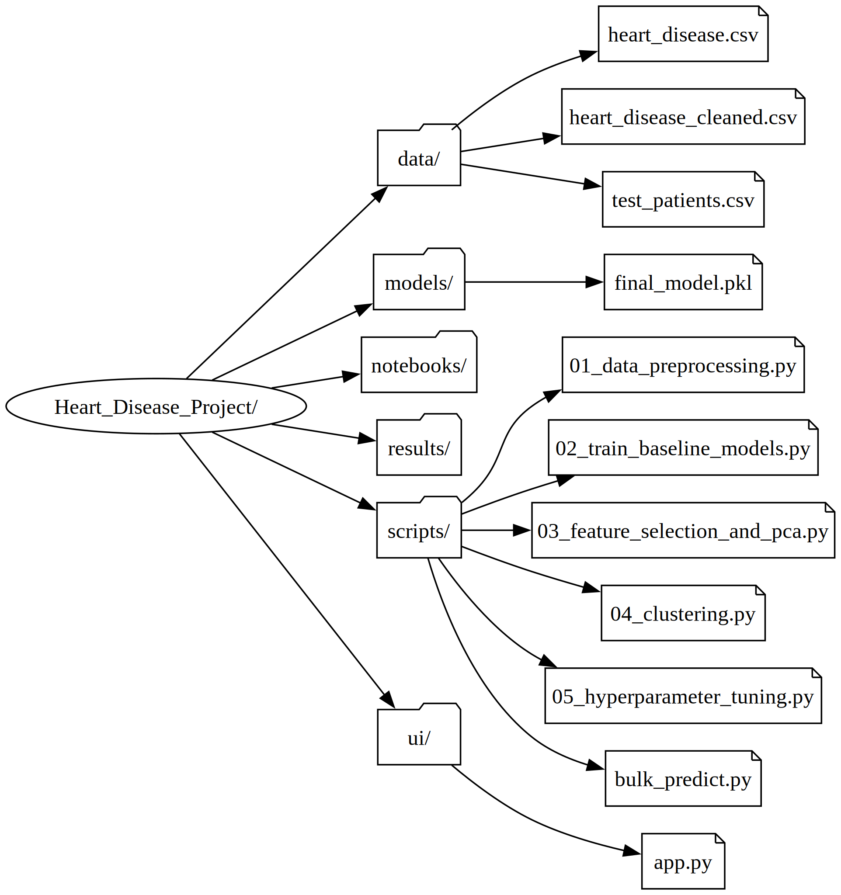
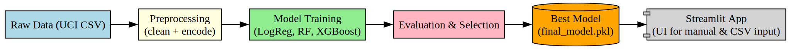
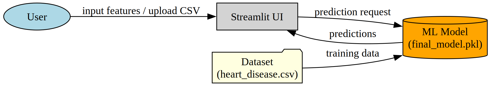

# 🫀 Heart Disease Risk Prediction

[](#run-the-app-fast)  
[](https://scikit-learn.org/)  
[](https://www.python.org/)


## run the app (fast)
```powershell
# from project root (VS Code Windows PowerShell Terminal)
python -m venv venv
.\venv\Scripts\Activate.ps1
pip install -r requirements.txt
python scripts/01_data_preprocessing.py
python scripts/02_train_baseline_models.py
streamlit run ui/app.py
````

---

# Table of contents

* [Overview](#overview)
* [Prerequisites & Quick Setup (Windows)](#prerequisites--quick-setup-windows)
* [Dataset](#dataset)
* [Run the pipeline (detailed)](#run-the-pipeline-detailed)
* [Streamlit app — manual + CSV upload](#streamlit-app--manual--csv-upload)
* [CSV sample](#csv-sample)
* [Diagrams — (Project Structure, ML Workflow, System Architecture)](#diagrams--project-structure-ml-workflow-system-architecture)
* [Troubleshooting](#troubleshooting-common-problems)
* [Git & repo hygiene tips](#git--repo-hygiene-tips)
* [Future Improvements](#future-improvements)
* [Disclaimer & author](#final-notes--legal)

---

# Overview

This repository contains a reproducible pipeline for predicting heart disease (UCI dataset).
It includes: preprocessing, feature selection/PCA, baseline model training, clustering, hyperparameter tuning, model export, a Streamlit UI (single-entry + CSV upload), and scripts for bulk predictions.

## Project Structure



## ML Workflow



## System Architecture


---

# Prerequisites & Quick Setup (Windows)

1. Install **Python 3.11** (64-bit) and add to PATH.
2. Open **PowerShell** and run:

```powershell
cd C:\Users\<YOUR_USERNAME>\Desktop\Heart_Disease_Project # Replace with the PATH of your workspace
python -m venv venv
Set-ExecutionPolicy -ExecutionPolicy RemoteSigned -Scope CurrentUser
.\venv\Scripts\Activate.ps1
pip install -r requirements.txt
```

Verify:

```powershell
python --version
pip --version
dot -V
```

---

# Dataset — exact steps to prepare 
# `data/heart_disease.csv`

1. Extract `heart+disease.zip`.
2. Copy `processed.cleveland.data` into `data/`.
3. Convert with the script:

```python
# scripts/convert_to_csv.py
import pandas as pd
col_names = [
    "age","sex","cp","trestbps","chol","fbs","restecg","thalach",
    "exang","oldpeak","slope","ca","thal","target"
]
df = pd.read_csv("data/processed.cleveland.data", names=col_names)
df.to_csv("data/heart_disease.csv", index=False)
print("Saved data/heart_disease.csv")
```

Run:

```powershell
python scripts/convert_to_csv.py
```

---

# Run the pipeline (detailed)

**1. Preprocess**

```powershell
python scripts/01_data_preprocessing.py
```

Creates `data/heart_disease_cleaned.csv`.

**2. Train baseline models**

```powershell
python scripts/02_train_baseline_models.py
```

Creates `models/final_model.pkl` and results in `results/`.

**3. PCA & feature selection (optional)**

```powershell
python scripts/03_feature_selection_and_pca.py
```

**4. Clustering (optional)**

```powershell
python scripts/04_clustering.py
```

**5. Hyperparameter tuning (optional, long)**

```powershell
python scripts/05_hyperparameter_tuning.py
```

**6. Bulk predict**

```powershell
python scripts/bulk_predict.py
```

Outputs to `results/test_predictions.csv`.

---

# Streamlit app — manual + CSV upload

```powershell
streamlit run ui/app.py
```

* Manual Entry: enter patient data one by one.
* Upload CSV: upload file with same columns as training data, returns predictions in table and downloadable CSV.

---

# CSV sample 
# (place at `data/test_patients.csv`)

# 📊 Example Prediction 
```csv
age,trestbps,chol,thalach,oldpeak,sex,cp,fbs,restecg,exang,slope,ca,thal
54,130,250,160,1.0,1,0,0,1,0,2,0,2
35,120,200,180,0.0,0,2,0,0,0,0,0,1
70,145,300,130,3.5,1,0,1,1,1,2,3,3
```
**Output:**

| age | trestbps | chol | thalach | oldpeak | sex | cp | fbs | restecg | exang | slope | ca | thal | prediction |
| --- | -------- | ---- | ------- | ------- | --- | -- | --- | ------- | ----- | ----- | -- | ---- | ---------- |
| 54  | 130      | 250  | 160     | 1.0     | 1   | 0  | 0   | 1       | 0     | 2     | 0  | 2    | Low Risk   |
| 35  | 120      | 200  | 180     | 0.0     | 0   | 2  | 0   | 0       | 0     | 0     | 0  | 1    | Low Risk   |
| 70  | 145      | 300  | 130     | 3.5     | 1   | 0  | 1   | 1       | 1     | 2     | 3  | 3    | High Risk  |


---

# Diagrams — (Project Structure, ML Workflow, System Architecture)

Scripts in `diagrams_charts` generate three diagrams:

* `project_structure.svg` --> [Project Structure](#project-structure)
* `workflow_diagram.svg` --> [ML Workflow](#ml-workflow)
* `system_architecture.svg` -->[System Architecture](#system-architecture)

Run with Graphviz installed:

```powershell
python make_project_structure.py
python make_workflow_diagram.py
python make_system_architecture.py
```
---

# Troubleshooting (common problems)

**Activate.ps1 blocked**

```powershell
Set-ExecutionPolicy -ExecutionPolicy RemoteSigned -Scope CurrentUser
```

**OneHotEncoder error**
Use `sparse_output=False` instead of `sparse=False`.

**Graphviz not found**
Add `C:\Program Files\Graphviz\bin` to PATH, then restart your VS Code. Verify with `dot -V`.

**Model not found**
Ensure `ui/app.py` uses:

```python
MODEL_PATH = os.path.join('models','final_model.pkl')
```

**dict has no attribute predict**
Access pipeline with:

```python
loaded = joblib.load("models/final_model.pkl")
pipeline = loaded['pipeline']
```

---

# Git & repo hygiene tips

```
venv/
__pycache__/
*.pyc
.DS_Store
models/
results/
data/processed.*
```

---

# Future Improvements

* Add deep learning models (TensorFlow / PyTorch)
* Deploy to cloud (Streamlit Cloud / Heroku / AWS)
* Add explainability with SHAP or LIME
* Create REST API wrapper with FastAPI

---

# Final notes & legal

This repository is for educational purposes only, not for medical use.

---

## Author

Developed by [Fady Romany](https://github.com/Eng-fady)
🎯 For learning, experimentation, and educational demonstrations.
